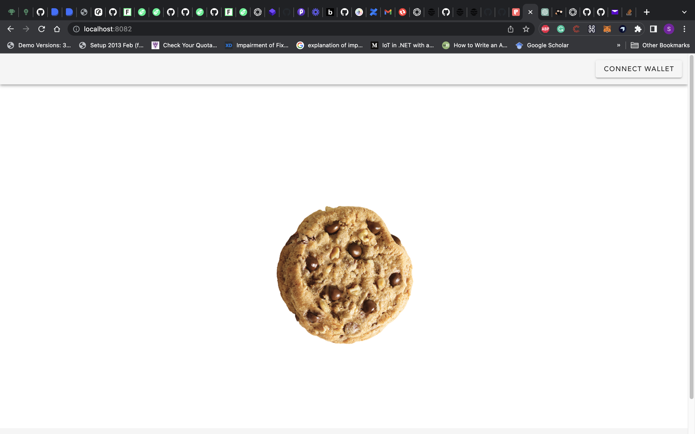
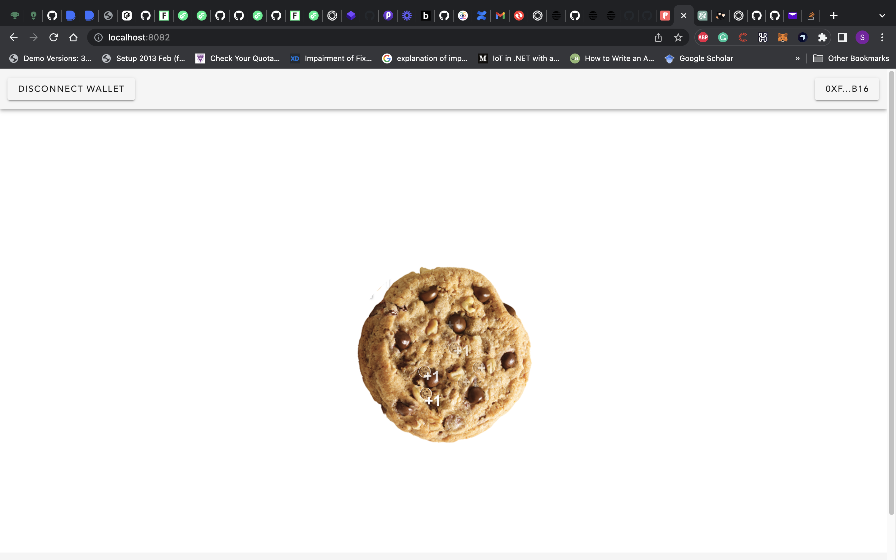

### Cookie Clicker

This repo contains artifacts for my interpretation of what the web3 version of the cookie clicker game could be. Not all functions could be implemented. but the basics are there. I would need to plan for some time to get a super awesome game, and this version was a way for me to get started with learning the nuts and bolts of the Aptos ecosystem.

### Installation

There is a make file that one could use to run most of the required commands, like unit testing, compiling, etc.

## UI

Before anything, you need to navigate to the UI folder and run `yarn` or `npm i`.

To start the server, run `yarn serve` or `npm run serve`.

## Modules- Node

To start the Aptos local node, run `make start_node`. Before this, please ensure you have installed the CLI library (see: https://aptos.dev/tools/install-cli/automated-install/#install).

## Modules

To compile the modules, run `make compile`.

To run the unit tests against the module, run `make test`.

### Modules

There are two modules used, which can be found in the sources folder.

1. cookie_clicker

2. cookie_nft

I was overly ambitious with trying to separate the files into two, but eventually decided I would combine everything into a single file. In future versions, I may come back and split them, but for now, my knowledge of the ecosystem and the move language is quite poor.

## cookie_clicker

This contract is used to initialize the game and contains all functionality required to play the game. The NFT issued to users is also contained in the same module.

## UI

I also went as far as to start developing a front end for the game; it's still WIP but should be done soon. It's a bit challenging to build the front end since I'm using Vue and there are no resources I found that use Vue, mostly React (roles and eyes).

## UI screenhosts

### Improvements

- Ability for users to pay to play (WIP)
- Ability for users to claim the tokens needed to play the game once off (WIP)
- Ability for users to exchange their NFTs for play tokens
